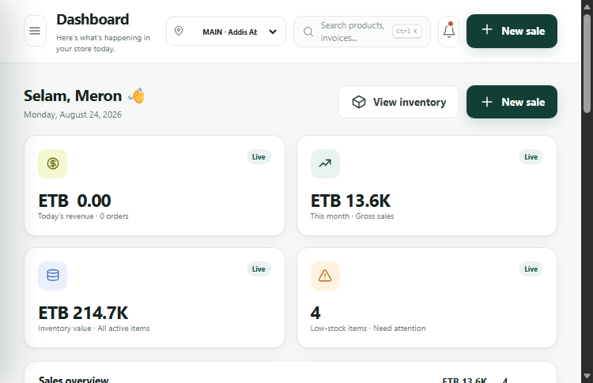

# Nile Stock

Nile Stock is a full-stack inventory, sales, purchasing and payment system designed as an Ethiopia-ready starting point for auto spare-parts businesses. It runs on Node.js with an atomic local datastore for development and PostgreSQL for production.



## Included

- Employee accounts with administrator, manager, cashier and storekeeper roles
- Signed HTTP-only sessions, login throttling, password rotation and audit history
- Dashboard with revenue, stock value, low-stock alerts and seven-day sales trends
- Spare-parts catalogue with SKU, barcode, brand, vehicle compatibility, rack location, margin and reorder levels
- Stock movement ledger plus physical stock counts and automatic reconciliation
- Point of sale with product/SKU/barcode search, category filters, live stock limits, discount and configurable VAT
- Cash, Telebirr, CBE Birr, POS/card and split-payment recording
- Bank-transfer recording with all 32 banks in the current National Bank of Ethiopia directory
- Credit sales, partial payments, receivables and printable 80 mm invoices
- Customer quotations that convert to invoices, plus item returns, credits and refunds
- Supplier purchases that update quantity and latest cost automatically
- Customers and suppliers with phone, address, TIN and outstanding balance
- Operating expenses, payment ledger, net-profit reports and CSV export
- Bank-level payment filtering, receipt details and CSV reporting
- Configurable business identity, TIN, VAT registration, VAT rate, invoice prefixes and receipt footer
- Optional hosted Chapa checkout with server-side initialization and callback verification
- PostgreSQL migration, checksummed scheduled backups, guarded restore and a production-readiness checklist
- Multi-branch stock balances, branch-filtered operations and audited inter-branch transfers
- Security headers, Docker deployment support and health checks
- Responsive desktop, tablet and mobile layouts

## Run locally

Requirements: Node.js 20 or newer.

```powershell
npm.cmd start
```

Open <http://127.0.0.1:3000>.

Demo accounts:

- Administrator: `admin@nile.et` / `admin123`
- Cashier: `cashier@nile.et` / `cashier123`

The initial data file is created at `data/store.json` on first start. Change both demo passwords before using real business data.

## Configuration

Copy `.env.example` values into your hosting environment. Node does not load `.env` automatically in this dependency-free setup, so provide them through the process manager, container, or shell.

| Variable | Purpose |
| --- | --- |
| `PORT` | HTTP port; defaults to `3000` |
| `HOST` | Bind address; defaults to `127.0.0.1` |
| `NODE_ENV` | Set to `production` on the deployed server |
| `PUBLIC_BASE_URL` | Public HTTPS address used in online-payment callbacks |
| `SESSION_SECRET` | Long random value used to sign session cookies |
| `COOKIE_SECURE` | Set to `true` when deployed behind HTTPS |
| `CHAPA_SECRET_KEY` | Enables hosted Chapa online collection |
| `DATABASE_URL` | PostgreSQL connection string used for production persistence |
| `DATABASE_SSL` | Enables TLS for PostgreSQL connections |
| `DATABASE_SSL_REJECT_UNAUTHORIZED` | Controls PostgreSQL certificate validation; keep `true` when possible |
| `DATABASE_POOL_SIZE` | PostgreSQL connection-pool limit |
| `BACKUP_DIR` | Directory for checksummed logical backups |
| `BACKUP_INTERVAL_HOURS` | Automatic backup interval; `0` disables scheduling |
| `BACKUP_RETENTION_COUNT` | Number of recent backups retained |
| `DATA_FILE` | Optional custom datastore path |

Example PowerShell session:

```powershell
$env:SESSION_SECRET = 'replace-with-a-long-random-secret'
$env:PUBLIC_BASE_URL = 'https://stock.example.et'
$env:COOKIE_SECURE = 'true'
$env:CHAPA_SECRET_KEY = 'CHASECK-...'
npm.cmd start
```

## Verify

```powershell
npm.cmd run check
npm.cmd test
```

The integration suite uses an isolated temporary datastore and verifies authentication, employee permissions, products, stock counts, taxable sales, quotations, returns/refunds, expenses, supplier receiving, backups and reporting.

Database and backup commands:

```powershell
npm.cmd run db:check
npm.cmd run db:migrate
npm.cmd run backup
npm.cmd run backup:restore -- <backup-file> --confirm
```

## Production notes

Follow [DEPLOYMENT.md](DEPLOYMENT.md) before entering real business data. The in-app Settings page reports database, HTTPS, cookie, credentials, backup and Chapa readiness. Have an Ethiopian accountant confirm the invoice, VAT and fiscal-device requirements that apply to the business. Chapa credentials stay on the server and successful callbacks are verified before a payment is applied.
